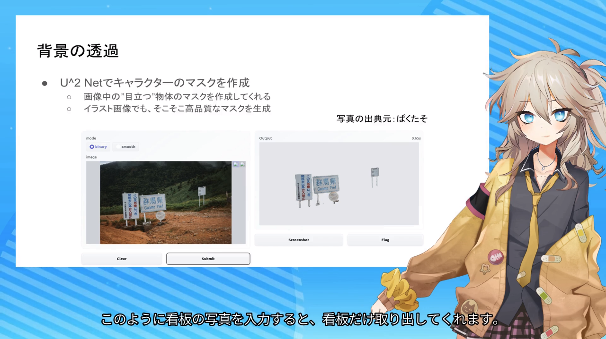

# zundavox
プレゼン動画を生成するソフトウェアです。
次の用途に対応しています。

* 人が説明している説明動画から、キャラクターが説明している説明動画を生成する
* 原稿とスライドを用意して、キャラクターに読み上げてもらう




## 対応キャラクター
* ずんだもん
* 春日部つむぎ

## デモ
[Google Colaboratory](https://colab.research.google.com/drive/1IQsydGzX6o7dmUScnq5npiMpOs27McB6?usp=sharing)で試すことができます。
ColaboratoryのPro+プランに加入していない場合、３分程度の動画までしか生成できないため、長い動画を生成したい場合は、ローカル環境を構築することをおすすめします。

## インストール方法
インストール手順は大きく分けて、依存ソフトウェアのインストールとVoicevoxのインストールの２つがあります。

### 依存ソフトウェアのインストール
依存ソフトウェアをインストールするために下記手順を実行してください。
```bash
# Pythonモジュールのインストール
git clone https://github.com/xiong-jie-y/zundavox.git
pip install mmcv-full -f https://download.openmmlab.com/mmcv/dist/cu111/torch1.10.0/index.html

cd zundavox
pip install -r requirements.txt
pip install -e .

pip install git+https://github.com/xinntao/Real-ESRGAN
pip install anime-face-detector

# 機械学習モデルのダウンロード
mkdir -p data
wget -O data/combiner.pt https://www.dropbox.com/s/at2r3v22xgyoxtk/combiner.pt?dl=0
wget -O data/eyebrow_decomposer.pt https://www.dropbox.com/s/pbomb5vgens03rk/eyebrow_decomposer.pt?dl=0
wget -O data/eyebrow_morphing_combiner.pt https://www.dropbox.com/s/yk9m5ok03e0ub1f/eyebrow_morphing_combiner.pt?dl=0
wget -O data/face_morpher.pt https://www.dropbox.com/s/77sza8qkiwd4qq5/face_morpher.pt?dl=0
wget -O data/two_algo_face_rotator.pt https://www.dropbox.com/s/ek261g9sspf0cqi/two_algo_face_rotator.pt?dl=0

# 設定ファイルの作成
touch ~/.zundavox.yaml
```

### Voicevoxのインストール
Voicevoxをインストールして、本ソフトウェアを利用する際に毎回起動しておいてください。
インストールは[Voicevox公式サイト](https://voicevox.hiroshiba.jp/)に従ってください。

## 利用方法
### 人が話す動画をキャラクターが話す動画に変換する場合
#### 原稿ファイルの生成
説明動画を用意したら、まずはその動画に音声認識をかけて原稿ファイルを生成します。
音声認識にはAzureとESPNetが使えますが、Azureのほうが認識精度が高くおすすめです。

音声認識にazureを利用する場合、azureに登録して、APIキーを取得してください。 キー取得方法は、例えば[このサイト](https://qiita.com/masaya3/items/86388fad4a4e1ce2d6fc#cognitive-services%E3%81%AE%E9%9F%B3%E5%A3%B0%E3%82%B5%E3%83%BC%E3%83%93%E3%82%B9%E3%82%92%E4%BD%9C%E6%88%90%E3%81%99%E3%82%8B)などを参考にしてください。
取得したキーを~/.zundavox.yamlに次のように入力してください。

```yaml
azure:
  subscription: ${取得したキー}
```
その後、下記コマンドを実行してください。
ESPNetでお試ししたい場合は下記コマンドの`azure`を`espnet`に変更してください。
ESPNetを利用する場合APIキーなどは不要です。
```
python scripts/generate_script_from_video.py \
    --video-path ${入力動画のパス} \
    --output-script-path ${原稿ファイルの出力パス} \
    --recognition-mode azure
```
#### 原稿ファイルの修正
音声認識には誤りがありますので、生成した原稿ファイルを手作業で修正してください。

原稿ファイルのサンプル例は下記の通りです。
```
[video2 /content/workspace/slide4_2.mp4]
[wait 0.768]
つつ次にこれらの音声の解析方向や動画の生成方法について説明します,{"length": 5.664}
```
1行目に書かれているパスはプログラムの絶対パスである必要があるので、必要に応じて修正してください。
2行目は発話開始時間です。
3行目の、「,」より右側は文の情報でいまは長さが入っています。
左側は本文で、ここに認識誤りがあれば修正します．
この場合、先頭の「つつ」を除去すればよいです。
「,」を削除しないように注意してください。
あと、空文がある場合waitの行も含めて削除してください。
例えば、次のような二行を見つけたら削除してください
```
[wait 0.332]
,{"length": 0.622}
```

#### 説明動画の生成
次に下記コマンドで説明動画を生成してください。背景動画ファイルはどこかからダウンロードしてください。
```
python scripts/generate_presentation_video.py \
  --script-path ${原稿ファイルのパス} \
  --background-video-path ${背景動画ファイルのパス} \
  --character zunda1 \
  --output-video-path ${説明動画の出力パス} \
  --output-subtitle-path ${字幕の出力パス}
```

### スライドと原稿から説明動画を生成する場合
動画ファイル、原稿ファイル、PDFスライドを用意して下記コマンドを実行してください。
```
python scripts/generate_presentation_video.py \
  --script-path ${原稿のパス} \
  --background-video-path ${背景動画のパス} \
  --pdf-slide-path ${PDFスライドのパス} \
  --character zunda1 \
  --output-video-path ${動画の出力パス} \
  --output-subtitle-path ${字幕ファイルの出力パス} \
  --config-file configs/lightweight.yaml
```

## 免責事項
* 本モジュールを使用したことによる一切の損害について、開発者は責任を負いません。

## 利用規約
### ずんだもんの動画を作成する場合
ソフトウェアの商用利用は禁止します。
ただし、広告収入は商用利用ではありません。同人活動は原価を回収するレベルの収益であれば商用利用ではありません。
また、技術紹介に利用する場合は商用利用は可能です。

詳しくは東北ずんこ[キャラクターガイドライン](https://zunko.jp/guideline.html)を参考にしてください。
また、作成した動画には「VOICEVOX:ずんだもん」というクレジットを付与してください。

### 春日部つむぎの動画を作成する場合
商用利用が可能です。
[春日部つむぎキャラクターガイドライン](https://tsukushinyoki10.wixsite.com/ktsumugiofficial/%E5%88%A9%E7%94%A8%E8%A6%8F%E7%B4%84)に従ってください。

作成した動画には「VOICEVOX:春日部つむぎ」というクレジットを付与してください。

### 派生ソフトウェアを作成する場合
このソフトウェアの全て、もしくは一部を組み込んだ有料サービス・有料アプリの提供は原則禁止します。有料サービス・有料アプリ開発への利用が禁止されている点以外はソースコードのライセンス規約は[GPL 3.0](https://www.gnu.org/licenses/gpl-3.0.en.html)とします。

有料サービスを提供したい場合は、相談いただければ別途ライセンスを作成します。

## クレジット
* キャラクターのアニメーション生成に[Talking Anime Head 2](https://github.com/pkhungurn/talking-head-anime-2-demo)を使用しています。
* ずんだもんのキャラクター画像に東北ずんこの[ずんだもん画像](https://zunko.jp/con_illust.html)を利用しています。
* 春日部つむぎのキャラクター画像に[春日部つむぎ公式の立ち絵画像](https://seiga.nicovideo.jp/seiga/im10842587)を利用しています。